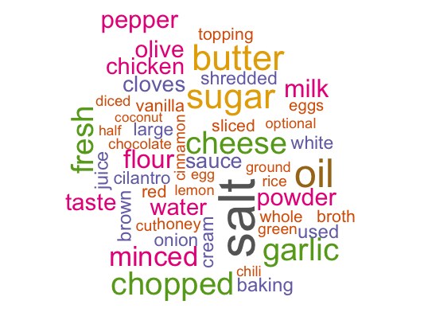
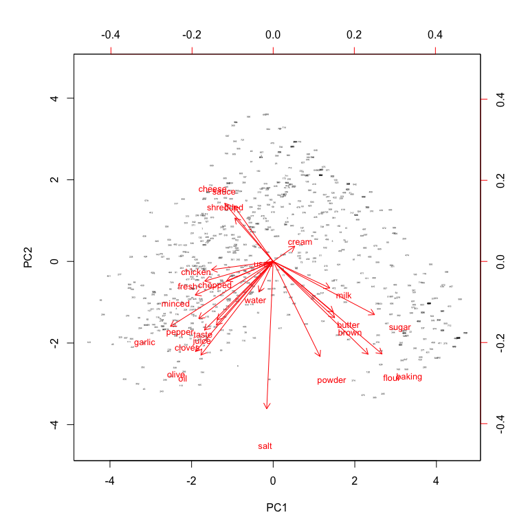
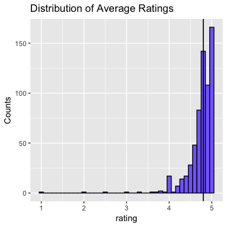
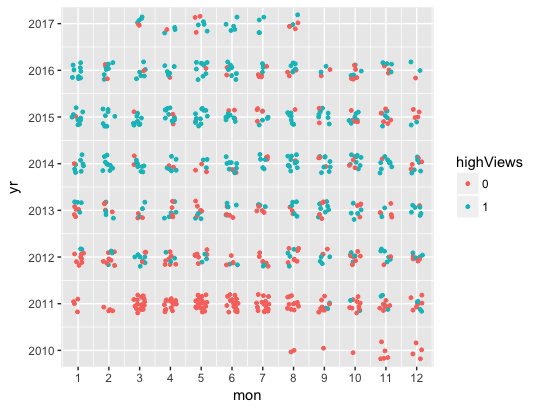
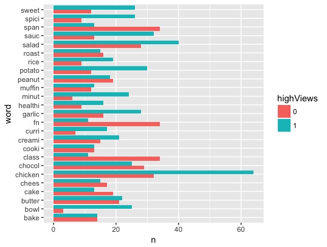

# Scraping and Wrangling Data: Analyzing online food blogs with R
#### Author: Burak Himmetoglu
---------

The web is an ocean where data scientists can gather lots of useful and interesting data. Despite its vastness, this data usually comes in a rather messy format, and requires significant cleaning and wrangling before it can be used in an inferential study. Therefore, the data scientist's **hacking skills** are needed for this usually quite cumbersome task.  

In this tutorial, I will walk the reader through the steps of obtaining, cleaning and visualizing data scraped from the web using R. As an example, I will consider online food blogs and illustrate how one can get insights on recipes, ingredients and visitors' food preferences. The tutorial will also illustrate the use of data wrangling by [tidyverse](https://www.tidyverse.org/), and natural language processing with [tidytext](https://cran.r-project.org/web/packages/tidytext/vignettes/tidytext.html) packages in R. These packages offer an excellent set of data wrangling and visualization tools, which have made R one of the go-to language for data scientists. 

## Web Scraping
First, we need to obtain the data from the blog posts. For this tutorial, I have chosen to scrape data from two sites:

1. [Pich of Yum](http://pinchofyum.com)
2. [The Full Helping](https://www.thefullhelping.com/)

These are excellent food blogs with lots of great recipes and nice photographs. Let us consider the first blog (Pinch of Yum) as an example, since it has more recipe entries. There are 51 pages (at the time where this tutorial was written) of recipes, each containing 15 recipe links. The first task is to collect all the links to these recipes, which we can do with the following code snippet

```r
get_recipe_links <- function(page_number){
  page <- read_html(paste0("http://pinchofyum.com/recipes?fwp_paged=", 
  			as.character(page_number)))
  links <- html_nodes(page, "a")
  
  # Get locations of recipe links
  loc <- which(str_detect(links, "<a class"))
  links <- links[loc]

  # Trim the text to get proper links
  all_recipe_links <- map_chr(links, trim_)
  
  # Return
  all_recipe_links
 }
 ```

 Given a page number (1 to 51), the function `get_recipe_links` first reads the given page, and then stores all the links to each recipe. In every page, the links to recipes are found within `<a class="block-link" href=" ... ">`, so we first get the nodes associated with *a* by the `html_nodes` function of the `rvest` package. Then, using `str_detect`, we obtain the locations of each link as a list. The `trim_` function is applied on all the links in the list by `map_chr` function, which returns a clean link without some unwanted characters like `\` and `<`.  `trim_` is a user function which looks like

 ```r
trim_ <- function(link){
	temp1 <- str_split(link, " ")[[1]][3] %>%
      str_replace_all("\"", "") %>% # Remove \'s
      str_replace("href=", "") %>%
      str_replace(">", " ")

    # Return 
    str_split(temp1, " ")[[1]][1]
 }
```
To be able to see how I came up with these, the reader should open one of the pages and look at the html source (which can be done by any browser's source view tool). The source code can be messy, but locating relevant pieces of information by repeating patterns become straightforward after looking through a few of the pages that are being scraped. The code for scraping all the recipe links from [The Full Helping](https://www.thefullhelping.com/) is almost identical, with a few small twists. 

Now we have all the links, the next step is to one by one connect to each link and gather the data from each recipe. This step is more tedious than the previous one, since every site stores its recipe data in a different format. For example, [Pinch of Yum](http://pinchofyum.com) uses a `json` format for each recipe, which is excellent since the data is pretty much standard across all the pages. Instead, [The Full Helping](https://www.thefullhelping.com/) has the recipe information in html, so it requires a bit more work to collect. 

Let's look at how we collect data from each recipe in Pinch of Yum. The below code snippet illustrates the main pieces of this process

```r
# Get the recipe page
page <- read_html(link_to_recipe)
  
# Get recipe publish date/time
meta <- html_nodes(page, "meta")
dt <- meta[map_lgl(meta, str_detect, "article:published_time")] %>%
    str_replace_all("\"|/|<|>", " ") %>%
    str_replace_all("meta|property=|article:published_time|content=", "") %>%
    str_trim() %>%
    str_split("T")
  
date <- dt[[1]][1]
time <- dt[[1]][2]

# JSON data
script_ <- html_nodes(page, "script")
loc_json <- which(str_detect(script_, "application/ld"))
if (length(loc_json) == 0){
  return(NULL) # If the link does not contain a recipe, just return null
}
  
# Load the data to JSON
recipe_data <- fromJSON(html_text(script_[loc_json][[1]]))
```

The above code snippet first reads the page from a give `link_to_recipe`, then collects the date and time when the recipe is published and finally reads the recipe data which is in JSON format. The date/time information is stored in the node "meta" and after we get it, we simply clean it with `stringr` operations like `str_replace_all`, `str_trim` and `str_split`. I recommend the reader to open the source of one of the recipes in her/his browser and locate the *meta* node with date/time information and compare with the code snippet to see how it all works. 

Obtaining the JSON data is rather straightforward with `fromJSON` function of the `jsonlite` package. While the JSON data comes rather clean after this step, there are a few nooks and crannies one has to deal with to put the data in a useful format. I will not discuss these steps in this post, they are located in the repository and I recommend the reader to check them out. At the end, the user function `get_recipe_data` which contains the above snippet, return a data frame containing the recipe information from a given `link_to_recipe`. 

Now that we have the two functions `get_recipe_links` and `get_recipe_data`, we can scrape the whole site by using the following lines of code:

```r 
# Get all links
all_links <- 1:51 %>% map(get_recipe_links) %>% unlist()

# Get all recipes and combine in a single data frame
all_recipes_df <- rbind(all_recipes_df, 
                        get_recipe_data(link_to_recipe))
```
The data frame `all_recipes_df` contains all the recipes on the blog and has the following fields:

```
 [1] "name"                "pub_time"            "pub_date"            "description"        
 [5] "ingredients"         "prepTime"            "cookTime"            "nReviews"           
 [9] "rating"              "servingSize"         "calories"            "sugarContent"       
[13] "sodiumContent"       "fatContent"          "saturatedFatContent" "transFatContent"    
[17] "carbohydrateContent" "fiberContent"        "proteinContent"      "cholesterolContent" 
```

The code for The Full Helping is significantly different, and the returned data frame does not have the same fields. I will not discuss it here on the post, but the code is included in the repository for interested readers. 

## Data Wrangling Exploratory Analysis
Now that we have the collected all the recipes, we can do some exploration. First, let's see which words are most common in the recipes. We will make use of the `tidytext` and `tokenizers` packages for this task. The `ingredients` field contains a flat text file with each line ending with "\n". So our task is to split the text, remove any leftover html tags, and then convert the data frame in long format. What is meant with the long format is that each row will contain one word, so a single recipe is spread into multiple rows, whose size is determined by the number of words in the ingredients. This is achieved by the following code snippet

```r
# Assing and ID number to each recipe
all_recipes_df <- all_recipes_df %>% mutate(ID = 1:nrow(all_recipes_df))

# Construct a data frame using words appearing in ingredients
df_ingrdt <- all_recipes_df %>% 
  select(ID, ingredients) %>%
  mutate(ingredients = str_replace(ingredients, "\n", " ") %>% 
  	str_replace("<.*?>", " ")) %>%
  unnest_tokens(word, ingredients)
```

For example, the first 10 entries would look like
```
##     ID   word
## 1    1      1
## 1.1  1      4
## 1.2  1    cup
## 1.3  1  olive
## 1.4  1    oil
## 1.5  1      2
## 1.6  1 cloves
## 1.7  1 garlic
## 1.8  1 minced
## 1.9  1      1
```
The `unnest_tokens` function achieves the transformation to the long format. Notice that this is not great, since we have numbers and other non-informative words that is so common in all the ingredients, that we would like to get rid of them. While there are better ways of removing very common but not informative words (e.g. [tf-idf](https://en.wikipedia.org/wiki/Tf-idf)), let's simply remove `stop_words` and some common measurement related words manually:

```r
# Stop words from tokenizers package
data("stop_words")

# Also remove the following (which is not included in stopwords)
word_remove = c("cup", "cups", "teaspoon", "teaspoons", "tablespoon", "tablespoons", 
                "ounce", "ounces", "lb", "lbs", "tbs", "tsp", "oz", "handful", "handfull",
                "inch", "i", "can")

df_ingrdt <- df_ingrdt %>% 
  filter(!(word %in% stopwords())) %>%
  filter(!(word %in% word_remove)) %>%
  filter(!(str_detect(word, "[0-9]")))  # Remove numbers as well
```

After this step, we have a much better looking data frame. The wordcloud from all the ingredients looks like



Let's also look at how words in all the recipes are associated with each other. Certain words would tend to cluster in certain types of recipes, for example one would expect to see sugar, flour and baking in a given recipe, but not garlic and chocolate (hopefully!). So let's perform a few steps of data wrangling to visualize how words are distributed. 

First let us simply reduce the number of words by limiting to the top 25

```r
top_words <- df_ingrdt %>% count(word, sort = TRUE) %>% slice(1:25)
df_ingrdt <-df_ingrdt %>%
  filter(word %in% top_words$word)
```

Now, we can use the `spread` function to spread the rows into columns, where there is one row for each recipe and words are columns containing the number of times they appear.

```r
df_ingrdt <- df_ingrdt %>% 
  group_by(ID) %>%
  count(word) %>%
  spread(key = word, value = n, fill = 0) %>%
  ungroup()
```

This is how `df_ingrdt` look like now:

```
##      ID baking brown butter cheese chicken chopped cloves cream flour
##   <int>  <dbl> <dbl>  <dbl>  <dbl>   <dbl>   <dbl>  <dbl> <dbl> <dbl>
## 1     1      0     0      0      0       0       4      1     0     0
## 2     2      0     0      0      0       1       1      0     0     0
## 3     3      0     0      0      0       0       0      0     0     0
## 4     4      0     2      0      0       0       2      1     0     0
## 5     5      0     0      1      0       0       0      0     0     0
## 6     6      0     1      0      1       0       0      1     0     1
## # ... with 16 more variables: fresh <dbl>, garlic <dbl>, juice <dbl>,
## #   milk <dbl>, minced <dbl>, oil <dbl>, olive <dbl>, pepper <dbl>,
## #   powder <dbl>, salt <dbl>, sauce <dbl>, shredded <dbl>, sugar <dbl>,
## #   taste <dbl>, used <dbl>, water <dbl>
```

The number of words appearing in a given recipe is not really what I we are looking for. Rather, we want to know whether a word appears in the ingredients or not. So, let’s process a bit further by

```r
vars <- setdiff(names(df_ingrdt), "ID")
df_ingrdt <- df_ingrdt %>%
  mutate_at(vars, function(x) ifelse(x > 0, 1, 0))
```

As a result, we obtain a table with one-hot encoded words for each recipe. Let's construct the [principal component](https://en.wikipedia.org/wiki/Principal_component_analysis) vectors, and use the first two to visualize the data

```r
## Principal components for ingredients
data <- df_ingrdt %>% select(-ID)
pc <- prcomp(data, scale = TRUE)

# Plot the first two principal components
biplot(pc, scale = FALSE, cex = c(0.2, 0.8) )
```



The x and y axes are the first two principal component vectors, and each red vector correspond to the projection of the associated word on these principal component vectors. The plot shows which words tend to be close to each other and provide some insights on the recipes:

* Ingredient vectors used in baking tend to be close to each other (milk, sugar, butter, flour etc.)
* Cheese, slice and shredded are close to each other (for obvious reasons)
* Garlic, minced, cloves, olive, oil are close to each other
* All of these groups of vectors point along different directions

We can perform a similar exercise for the `description` field as well, and it leads to similar results. 

## Inference

Now that we have gone through all this trouble and scraping and tidying the data, let's try to experiment with predictive algorithms. We can decide to go in several avenues here, but there are several issues here. One is temped to use the data for predicting ratings, however this is a bit problematic once we look at their distribution



Most of the ratings are all 5 stars! This is not a surprise, since individual food blogs tend to have a relatively small following and the followers are those who enjoy the recipes so they rate them high. Instead, let's split look at number of reviews and assign recipes with number of reviews higher than the median (which is 9 at the time) as `high` and smaller than the median as `low`. This is a much more balanced target to predict (actually, it is almost 50/50 high-low ratio since we use the median). 

Instead of the ingredients, let's look at how the name of the recipe effects whether it is rated a large number of times. We perform the same exercise as above (use the `name` field instead of `ingredients`), which you can find in the repository. We end up with a data frame whose first entries are as follows:

```
  ID highViews mon   yr     word
1  1         1   8 2017     best
2  1         1   8 2017    detox
3  1         1   8 2017 broccoli
4  1         1   8 2017    chees
5  1         1   8 2017     soup
6  2         1   8 2017 cheater'
```
The `ID` is the unique identifier of a recipe, `highViews` is 1 for recipes that are rated more than 9 times (i.e. the median), `yr` and `mon` are the year and month when the recipe is published and `word` is the [stem](https://en.wikipedia.org/wiki/Stemming) of the word that appears in the recipe. The next step is again spreading words to columns where each new column is either 1 or 0 (1 if the word is included in the name of the recipe, 0 otherwise). In this case, I chose the top 50 words appearing in the names of the recipes to keep in columns. Here is how the final table looks like:

```
     ID chicken salad chocol  span class    fn  sauc garlic butter potato sweet peanut creami spici  cake
  <int>   <dbl> <dbl>  <dbl> <dbl> <dbl> <dbl> <dbl>  <dbl>  <dbl>  <dbl> <dbl>  <dbl>  <dbl> <dbl> <dbl>
1     1       0     0      0     0     0     0     0      0      0      0     0      0      0     0     0
2     2       0     1      0     0     0     0     0      0      0      0     0      0      0     0     0
3     3       0     0      0     0     0     0     0      0      0      0     0      0      0     0     0
4     4       0     0      0     0     0     0     0      0      0      0     0      0      0     0     0
5     5       0     0      0     0     0     0     0      0      0      0     0      0      0     0     0
6     6       0     0      0     0     0     0     0      0      0      0     0      0      0     0     0
# ... with 39 more variables: chees <dbl>, roast <dbl>, minut <dbl>, bake <dbl>, bowl <dbl>, rice <dbl>,
#   cooki <dbl>, healthi <dbl>, muffin <dbl>, curri <dbl>, bar <dbl>, caramel <dbl>, coconut <dbl>,
#   soup <dbl>, appl <dbl>, cinnamon <dbl>, dress <dbl>, easi <dbl>, lemon <dbl>, pumpkin <dbl>,
#   bean <dbl>, corn <dbl>, quinoa <dbl>, honei <dbl>, ingredi <dbl>, pizza <dbl>, shrimp <dbl>,
#   tomato <dbl>, banana <dbl>, best <dbl>, lentil <dbl>, noodl <dbl>, squash <dbl>, bacon <dbl>,
#   crockpot <dbl>, rating <dbl>, highViews <dbl>, mon <dbl>, yr <dbl>
```

Before trying a model for predicting `highViews`, let's see whether we can obtain some insights by visualizing the data. Below is a plot that shows the high and low number of ratings in each month and year:



Notice that `highViews` increase by year. This is not surprising, since the blog started to gather following after some time when it first started. Now let's look at which words in the name of the recipe are correlated with `highViews`



The recipe names with word stems *chicken*, *potato* and *salad* tend to be rated more, while *fn*, *span* and *class* tend be rated less. OK, finally let's train a model:

```r
library(randomForest)
library(caret)
dat <- model_df %>% 
  select(-c(ID,rating))

# Training control
ctrl <- trainControl(method="cv", number=10, verboseIter = TRUE)
rf_grid <- expand.grid(mtry = c(2,5,10,15,20))

mod <- train(x = select(dat, -highViews), y = ifelse(dat$highViews == 1, "y","n"),
             method = "rf", trControl = ctrl, tuneGrid = rf_grid)
```

The above code snippet performs a 10-fold cross validation to find the best parameter `mtry` in the [Random forest](https://en.wikipedia.org/wiki/Random_forest) algorithm. `mtry` is the number of columns randomly picked to grow trees at each step. Once this is tun, the training ends with the best `mtry`=5 and results in 74% accuracy in predicting `highViews`. This is not great, but a good start. One can add more features that we have ignored in constructing our data to increase the accuracy. 

Random forest also gives us which features are the most important (using the amount a given feature reduces the Gini index, one of the most common error rates used for classification in tree based methods). These are the top ten most important features that Random Forest has found:

```
   MeanDecreaseGini variable
1         78.290588       yr
2         20.446105      mon
3          4.876325     bowl
4          4.703937  chicken
5          4.427031 crockpot
6          3.971014    minut
7          3.495288   lentil
8          3.203090    salad
9          3.107316     soup
10         3.067923    spici
```

The `yr` and `mon` are the most important features as expected from our analysis above. It looks like the word `bowl` is also very important, possibly due to the popularity of *one bown dinners* nowadays. 

## Final words
In this post, I illustrated the use of web scraping, data wrangling and natural language processing tools in R. As a case study, I showed how insgights can be obtaioned from the food blog data, such as the occurance of words and how they relate to the type of food as well as to the number of ratings a recipe receives. 

There are many interesting projects one can do with online food blog data, and this is only a scratch on the surface. Thanks for reading!

## About the author
Burak is a data scientist and a computational physicist currently working at UCSB. He holds a Ph.D in physics, and worked on computational modelling of materials and applications of machine learning for discovering new compounds. He has a wide range of interests including image recognition, natural language processing, and time-series analaysis for applications in healthcare data. 
Burak's projects can be viweved from his [personal site](https://burakhimmetoglu.com/).
