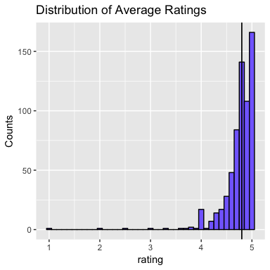
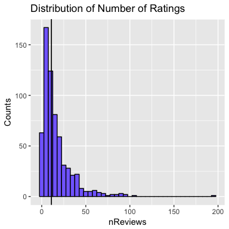
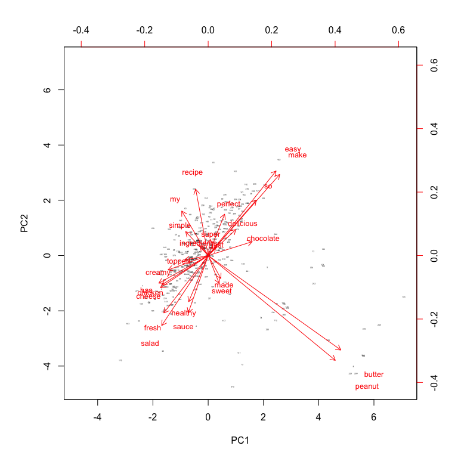

# Analyzing Online Food Blogs
B. Himmetoglu  


There are numerous online food blogs which are great resources, not only for getting inspiration to what to cook for dinner, but also for potential web scraping projects. In this notebook, I will demonstrate what can be done with the recipe data on a small set of recipes from the blog [Pinch of Yum](http://pinchofyum.com/). The notebook also illustrates an interesting use of the [tidyverse](http://tidyverse.org/) functions which are extremely useful. 


### Load the data frame containing all recipes

```r
load(file="all_recipes.RData")
```
We are using the already scraped data from the recipes in the blog The data is collected using `utilities.R` and `scrape.R` included in the [repository](https://github.com/bhimmetoglu/datasciencecom-r-tutorial/tree/master/src/pinchOfYum), where details can be studied in detail. For now, I will just explore the data. The data is loaded in the data frame `all_recipes_df` which contain the following:


```r
names(all_recipes_df)
```

```
##  [1] "name"                "pub_time"            "pub_date"           
##  [4] "description"         "ingredients"         "prepTime"           
##  [7] "cookTime"            "nReviews"            "rating"             
## [10] "servingSize"         "calories"            "sugarContent"       
## [13] "sodiumContent"       "fatContent"          "saturatedFatContent"
## [16] "transFatContent"     "carbohydrateContent" "fiberContent"       
## [19] "proteinContent"      "cholesterolContent"
```

The data contains 731 entries:

```r
nrow(all_recipes_df)
```

```
## [1] 731
```

### Data Wrangling

The data contains lots of interesting features, including ingredients, a short description of each recipe, number of reviews and average rating from site users, and nutritional information. Unfortunately, there are many `NA`s in the columns, as well as empty descriptions:


```r
# NAs
all_recipes_df %>% map_dbl(~sum(is.na(.x)))
```

```
##                name            pub_time            pub_date 
##                   0                   0                   0 
##         description         ingredients            prepTime 
##                 329                   0                 338 
##            cookTime            nReviews              rating 
##                 342                  88                  88 
##         servingSize            calories        sugarContent 
##                 623                 347                 347 
##       sodiumContent          fatContent saturatedFatContent 
##                 347                 347                 347 
##     transFatContent carbohydrateContent        fiberContent 
##                 347                 347                 347 
##      proteinContent  cholesterolContent 
##                 347                 347
```

```r
# Empty descriptions (aside from NAs)
all_recipes_df %>% filter(description =="") %>% count()
```

```
## # A tibble: 1 × 1
##       n
##   <int>
## 1     9
```
As can be seen, more than half of the data is missing from nutritional information as well as from the description column. This is rather unfortunate, since one could have used these nutritional information for some interesting modelling. However, we can still gain some interesting insights from an exploratory study. For example, let's have a look at the words used in the `ingredients` column


```r
# Assing and ID number to each recipe
all_recipes_df <- all_recipes_df %>% mutate(ID = 1:nrow(all_recipes_df))

# Construct a data frame using words appearing in ingredients
df_ingrdt <- all_recipes_df %>% 
  select(ID, ingredients) %>%
  mutate(ingredients = str_replace(ingredients, "\n", " ") %>% str_replace("<.*?>", " ")) %>%
  unnest_tokens(word, ingredients)
```

Here, we first assign a numerical `ID` to each recipe, the purpose of which will become clear later. Then, we pick ingredients and replace all the newline tags `"\n"` with empty spaces, and remove any left-over html tags (usually links to external sites about given ingredients). Then, the `unnest_tokens` function (from `tidytext` package) splits the `ingredients` into words and creates new rows for each recipe. In this new format (`ID`, `word`) each recipe is represented by multiple rows, the number of which is determined by the number of words (tokens) in the ingredients. For example:


```r
df_ingrdt[1:10,]
```

```
##     ID   word
## 1    1      1
## 1.1  1      4
## 1.2  1    cup
## 1.3  1  olive
## 1.4  1    oil
## 1.5  1      2
## 1.6  1 cloves
## 1.7  1 garlic
## 1.8  1 minced
## 1.9  1      1
```

```r
df_ingrdt[100:110,]
```

```
##      ID     word
## 2.29  2       or
## 2.30  2    other
## 2.31  2  protein
## 2.32  2       of
## 2.33  2   choice
## 3     3        1
## 3.1   3  serving
## 3.2   3       of
## 3.3   3 strongly
## 3.4   3   brewed
## 3.5   3   coffee
```

We will create word features from this data frame (`df_ingrdt`) below. Before doing so, we store the rating and review information, which we will then combine with the word features. 

```r
# Store ratings and nReviews in a separate data frame
df_reviews <- all_recipes_df %>% 
  select(ID, name, rating, nReviews)
```

Now, let's look at the most common words in the ingredients:

```r
df_ingrdt %>% count(word, sort = TRUE) %>% slice(1:10)
```

```
## # A tibble: 10 × 2
##           word     n
##          <chr> <int>
## 1            1  4417
## 2            2  2661
## 3          cup  1814
## 4            4  1060
## 5            3   901
## 6     teaspoon   809
## 7         cups   776
## 8  tablespoons   670
## 9           or   599
## 10        salt   549
```

Clearly, most of these words are uninformative. They mostly contain stop words (such as `or`, see below), units of measurement (in the world of cooking) and simple numbers. Let us remove such words

```r
# Stop words from tokenizers package
data("stop_words")

# Also remove the following (which is not included in stopwords)
word_remove = c("cup", "cups", "teaspoon", "teaspoons", "tablespoon", "tablespoons", 
                "ounce", "ounces", "lb", "lbs", "tbs", "tsp", "oz", "handful", "handfull",
                "inch", "i", "can")

df_ingrdt <- df_ingrdt %>% 
  filter(!(word %in% stopwords())) %>%
  filter(!(word %in% word_remove)) %>%
  filter(!(str_detect(word, "[0-9]")))  # Remove numbers as well
```
After this step, let's look at the most common words again


```r
df_ingrdt %>% count(word, sort = TRUE) %>% slice(1:10)
```

```
## # A tibble: 10 × 2
##       word     n
##      <chr> <int>
## 1     salt   549
## 2      oil   412
## 3   butter   367
## 4    sugar   358
## 5  chopped   318
## 6   garlic   315
## 7   cheese   311
## 8    fresh   302
## 9   minced   264
## 10   flour   242
```
which looks much better! I could have used more elaborate feature extraction methods from the ingredients, but I want to keep things simple here. So let's just use the top 25 words appearing in the ingredients and use them as features


```r
# Get the most common 25 words in the ingredients to be used in modellling
top_words <- df_ingrdt %>% count(word, sort = TRUE) %>% slice(1:25)
df_ingrdt <-df_ingrdt %>%
  filter(word %in% top_words$word)
```

Now, let's construct features (columns) from the word counts for each recipe using the `spread` function:

```r
# Spread the word counts to columns
df_ingrdt <- df_ingrdt %>% 
  group_by(ID) %>%
  count(word) %>%
  spread(key = word, value = n, fill = 0) %>%
  ungroup()
```

Here is what `df_ingrdt` looks like

```r
head(df_ingrdt)
```

```
## # A tibble: 6 × 26
##      ID baking brown butter cheese chicken chopped cloves cream flour
##   <int>  <dbl> <dbl>  <dbl>  <dbl>   <dbl>   <dbl>  <dbl> <dbl> <dbl>
## 1     1      0     0      0      0       0       4      1     0     0
## 2     2      0     0      0      0       1       1      0     0     0
## 3     3      0     0      0      0       0       0      0     0     0
## 4     4      0     2      0      0       0       2      1     0     0
## 5     5      0     0      1      0       0       0      0     0     0
## 6     6      0     1      0      1       0       0      1     0     1
## # ... with 16 more variables: fresh <dbl>, garlic <dbl>, juice <dbl>,
## #   milk <dbl>, minced <dbl>, oil <dbl>, olive <dbl>, pepper <dbl>,
## #   powder <dbl>, salt <dbl>, sauce <dbl>, shredded <dbl>, sugar <dbl>,
## #   taste <dbl>, used <dbl>, water <dbl>
```
where each row again represents a single recipe, and columns represent the word counts appearing in the ingredients. The number of words appearing in a given set of ingredients is not really what I am looking for. Rather, I want to know whether a word appears in the ingredients or not (I don't care how many times). So, let's process a bit further


```r
# We actually do not want word couts per recipe, rather one-hot encoded word features
vars <- setdiff(names(df_ingrdt), "ID")
df_ingrdt <- df_ingrdt %>%
  mutate_at(vars, function(x) ifelse(x > 0, 1, 0))
```

Now that we have a data frame with word features (`df_ingrdt`), let's merge it with the ratings and review data that we saved earlier:

```r
# Now combine with df_reviews by ID
df_ingrdt_reviews <- df_reviews %>%
  inner_join(df_ingrdt, by = "ID")

# Rating and nReviews are still characters. Let's convert them to numeric
df_ingrdt_reviews <- df_ingrdt_reviews %>%
  mutate(rating = as.numeric(rating)) %>%
  mutate(nReviews = as.numeric(nReviews))
```
Finally, we are ready for exploration. In principle, one can try to model this data, e.g. `lm(rating ~., df_ingrdt_reviews)`, but for the reasons that I will explain below, it does not lead to anything interesting. 

### Data Exploration

Let's look at the distribution of `ratings` and number of reviews(`nReviews`) for the recipes in our data set:

```r
# Distribution of reviews
g0 <- ggplot(df_ingrdt_reviews, aes(rating)) + 
  geom_histogram(color = "black", fill = "slateblue1", binwidth = 0.1) + 
  geom_vline(xintercept = median(df_ingrdt_reviews$rating, na.rm = T), na.rm = TRUE, size = 0.6) + 
  ylab("Counts") + ggtitle("Distribution of Average Ratings")
g0
```

```
## Warning: Removed 88 rows containing non-finite values (stat_bin).
```

<!-- -->

```r
# Distribution of number of ratings below 200
g1 <- ggplot(df_ingrdt_reviews %>% filter(nReviews < 200), aes(nReviews)) + 
  geom_histogram(color = "black", fill = "slateblue1", binwidth = 5) + 
  geom_vline(xintercept = median(df_ingrdt_reviews$nReviews, na.rm = T), na.rm = TRUE, size = 0.6) + 
  ylab("Counts") + ggtitle("Distribution of Number of Ratings")
g1 
```

<!-- -->

In both figures, the vertical line represents the median value(4.8 for `rating` and 11 for `nReviews`). One interesting observation is that most reviews are close to 5 stars and the number of reviews are below 50 (95th percentile). This is not very surprising, since individual food blogs tend to have a relatively small following and the followers are those who enjoy the recipes so they rate them high. This makes things rather difficult for modelling, since correlations between ingredients and rating will not be easily established from such data. So, instead of trying to model ratings, let's just look at the distribution of words. One way to visualize this is to use principal components analysis:


```r
## Principal components for ingredients
data <- df_ingrdt %>% select(-ID)
pc <- prcomp(data, scale = TRUE)

# Plot the first two principal components
biplot(pc, scale = FALSE, cex = c(0.2, 0.8) )
```

<!-- -->

The plot shows the first two principal components and the projection of individual features (i.e. words from ingredients) on them. I find this plot rather fascinating since it captures some interesting effects:

* Ingredient vectors used in baking tend to be close to each other (milk, sugar, butter, flour etc.)
* Cheese, slice and shredded are close to each other (for obvious reasons)
* Garlic, minced, cloves, olive, oil are close to each other
* All of these groups of vectors point along different directions

This is in fact similar to what one would observe in [word2vec](https://en.wikipedia.org/wiki/Word2vec) models. Let's repeat the same exercise for the `descriptions` which we have a much smaller number of observations available:


```r
# Non empty descriptions
df_descript <- all_recipes_df %>% filter(description != "") %>% filter(!is.na(description))

# Let's check the ingredient & rating relationship
df_descript <- df_descript %>% 
  select(ID, description) %>%
  mutate(description = str_replace(description, "\n", " ") %>% str_replace("<.*?>", " ")) %>%
  unnest_tokens(word, description)

# Remove unwanted words
df_descript <- df_descript %>% 
  filter(!(word %in% stopwords())) %>%
  filter(!(word %in% word_remove)) %>%
  filter(!(str_detect(word, "[0-9]")))  # Remove numbers as well

# Get the most common 25 words in the ingredients to be used in modellling
top_words <- df_descript %>% count(word, sort = TRUE) %>% slice(1:25)
df_descript <-df_descript %>%
  filter(word %in% top_words$word)

# Spread the word counts to columns
df_descript <- df_descript %>% 
  group_by(ID) %>%
  count(word) %>%
  spread(key = word, value = n, fill = 0) %>%
  ungroup()
```


```r
# Let's keep the word counts in this case
# Principal components
data <- df_descript %>% select(-ID)
pc <- prcomp(data, scale = TRUE)

# Plot the first two principal components
biplot(pc, scale = FALSE, cex = c(0.2, 0.8) )
```

<!-- -->

which also produces some interesting results. The fact that `peanut` and `butter` are almost collinear is clearly no surprise!
